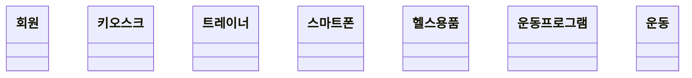
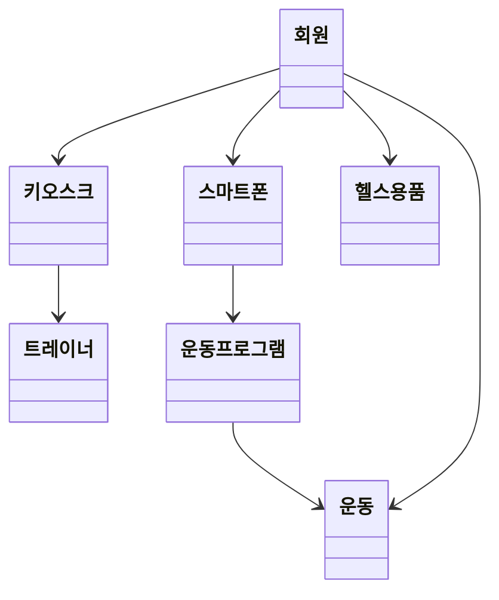
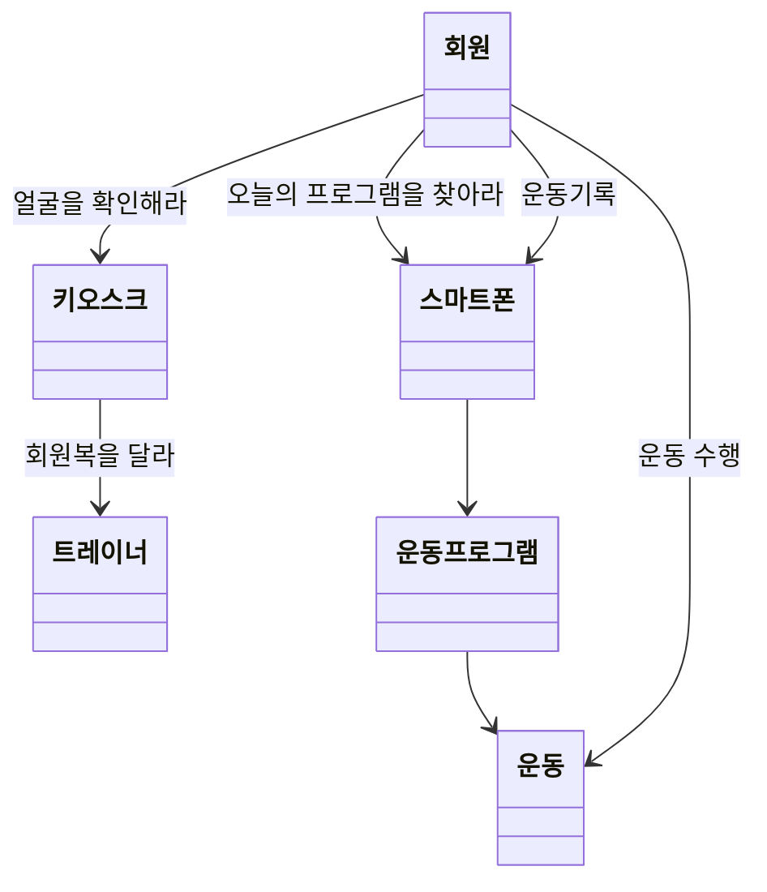

# OOP-sample


## 상황
1. 회원이 헬스장에 도착했다. 
2. 키오스크? 에 얼굴을 인식 하고 헬스장에 입장한다. 
3. 인포 직원? 분이 인사를 해준다. 
4. 직원에게 회원복을 받고 탈의실에서 환복을 한다. 
5. 환복을 마치고 스트레칭 존으로 이동하여 몸을 푼다. 
6. 자신의 가방을 가지고 오늘 프로그램을 확인한다. 
7. 오늘은 등 운동 하는 날이다. 
8. 스마트폰을 꺼내서 등운동 프로그램을 확인한다. 
9. 프로그램 진행...
	1. 바른 자세를 확인하고 수행한다.
	2. 운동에 맞는 용품을 가방에서 꺼내 사용한다. 
	3. 운동 후 통증이 있다면 통증 부위를 기록하고 대처법을 확인한다. 
10. 샤워 장 이동하여 샤워하고 나온다. 
## 헬스장에는 어떤 객체가? 
- 회원
- 키오스크 - 문지기
- 트레이너 - 서비스
- 스마트폰 - 기록 및 정보
- 헬스용품 - 운동 도움
	- 가방
	- 물통
	- 신발
	- 벨트
	- 스트랩
- 운동 프로그램 - 운동 루틴
- 운동 
	- 부위 : 가슴/등/어깨/하체/팔
	- 종류 : 맨몸/머신/덤벨/바벨
	- 부상이력 : 

## 객체간의 관계 



## 협력 찾기



## 인터페이스 정리

```Java
    class Member {
	    public SportingGoods checkFaceId(String faceId)
	    public void doExcercise(String exerciseName)
	    public Program getProgram(Date date)
	    public void recordExercise(String exerciseName)
    }
    
    class Kiosk {
	    public SportingGoods getMemberCloth(String faceId)
    }
	
    class Trainer 
	
	class SmartPhone
	
    class SportingGoods
	
	class Program
    
    class Exercise 
```

## 구현하기


